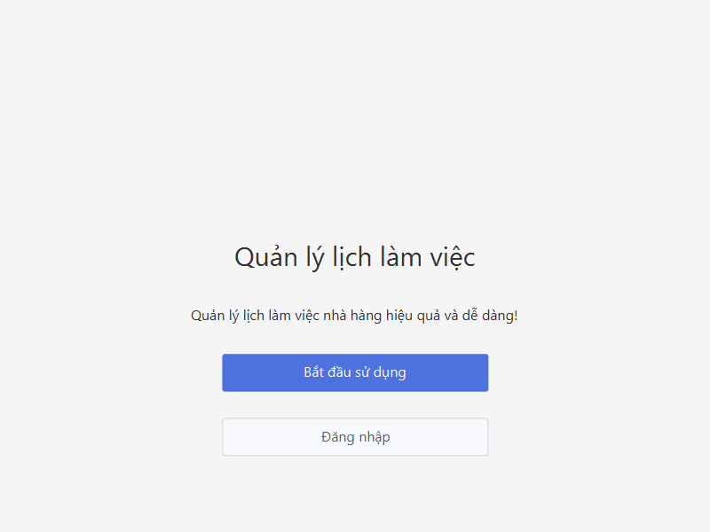
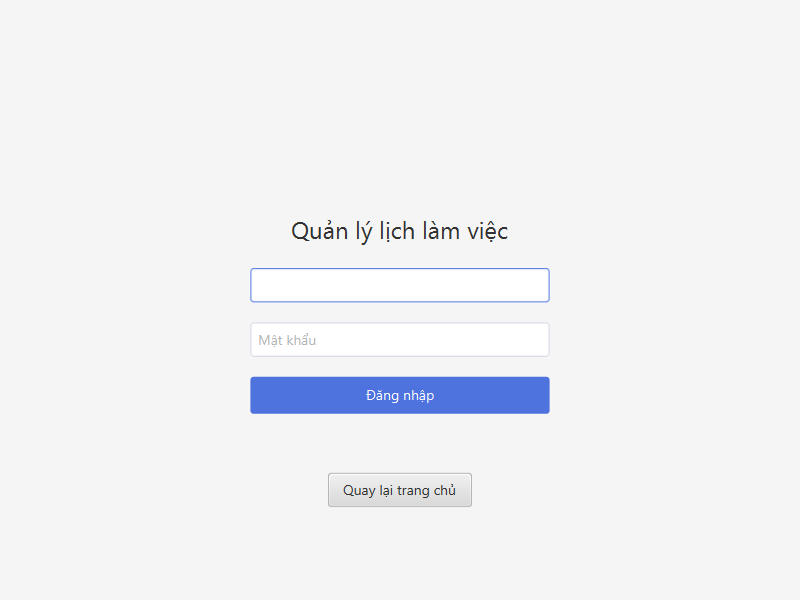
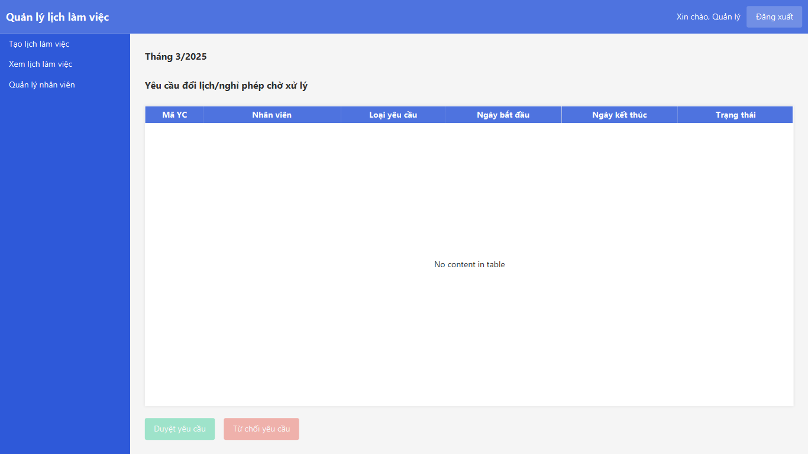
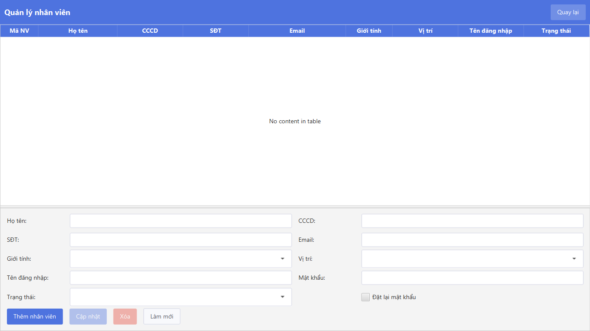
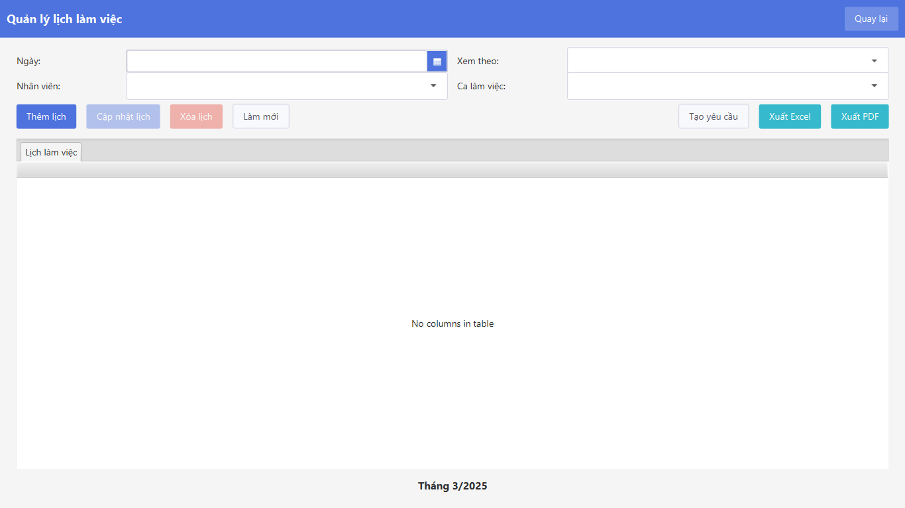
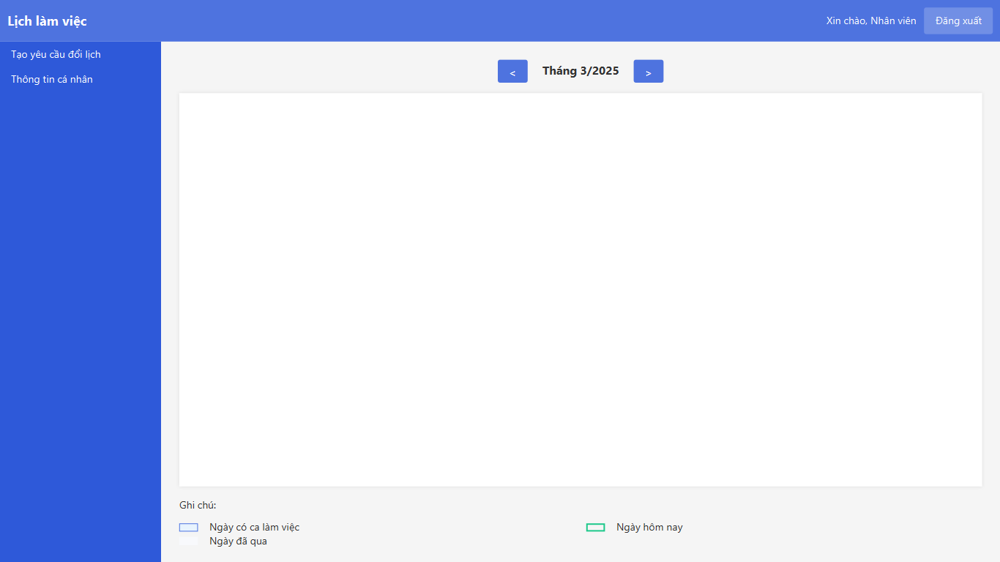
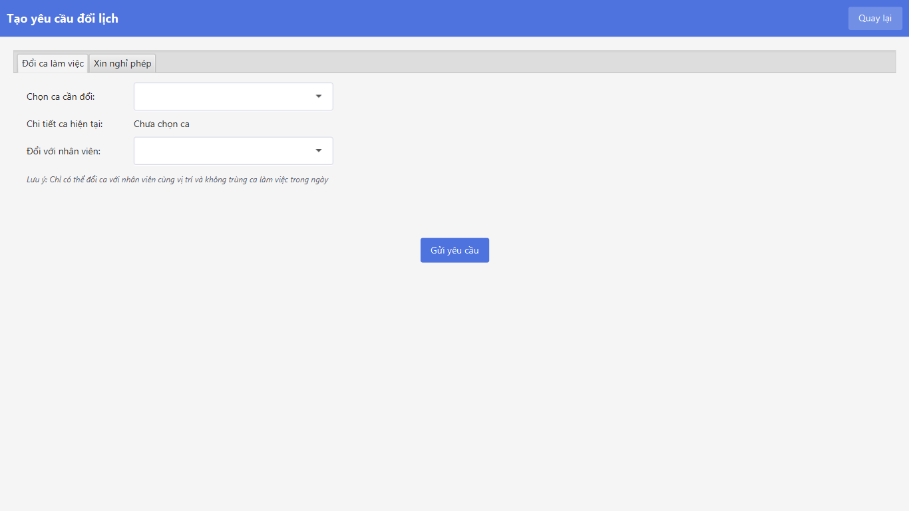
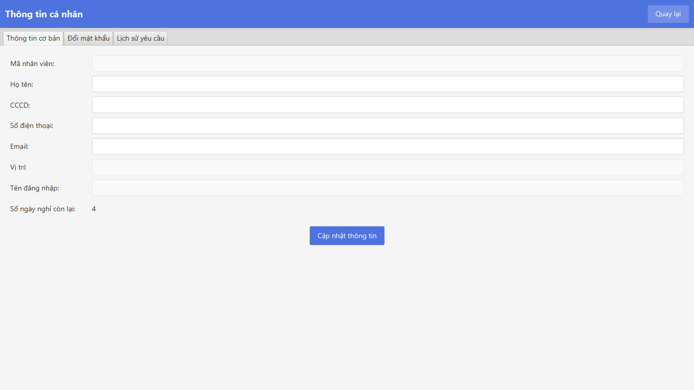

# Ứng dụng sắp xếp lịch làm việc

Ứng dụng desktop hỗ trợ quản lý và sắp xếp lịch làm việc cho nhân viên nhà
hàng. Dự án được xây dựng bằng JavaFX, Maven và SQL Server, hướng đến việc
giảm thời gian lập lịch thủ công và giúp nhân viên theo dõi lịch làm việc,
gửi yêu cầu đổi lịch hoặc nghỉ phép thuận tiện hơn.

## Chức năng chính

### Dành cho quản lý

- Tạo và quản lý lịch làm việc theo tháng.
- Quản lý hồ sơ, vị trí công việc và trạng thái nhân viên.
- Tiếp nhận, phê duyệt hoặc từ chối yêu cầu đổi lịch/nghỉ phép.
- Xuất lịch làm việc sang Excel và PDF.
- Đánh giá, phân bổ ca làm việc bằng thuật toán xếp lịch.

### Dành cho nhân viên

- Đăng nhập và xem lịch làm việc cá nhân.
- Theo dõi ca làm việc theo ngày, tuần hoặc tháng.
- Gửi yêu cầu đổi ca hoặc nghỉ phép.
- Cập nhật thông tin cá nhân và đổi mật khẩu.

## Giao diện ứng dụng

### Trang giới thiệu



### Đăng nhập



### Trang quản lý



### Quản lý nhân viên



### Quản lý lịch làm việc



<details>
<summary>Xem thêm giao diện dành cho nhân viên</summary>

### Lịch làm việc của nhân viên



### Gửi yêu cầu đổi lịch/nghỉ phép



### Hồ sơ nhân viên



</details>

## Video demo

[▶ Xem video demo toàn bộ ứng dụng](docs/demo/application-demo.mp4)

Video sử dụng dữ liệu mẫu an toàn và minh họa các luồng:

- Đăng nhập bằng vai trò quản lý và nhân viên.
- Duyệt yêu cầu đổi lịch/nghỉ phép.
- Quản lý nhân viên và lịch làm việc.
- Xuất báo cáo Excel/PDF.
- Xem lịch cá nhân, gửi yêu cầu và cập nhật hồ sơ.

## Công nghệ sử dụng

- Java 17 và JavaFX 23
- Maven
- Microsoft SQL Server
- JDBC
- BCrypt để băm mật khẩu
- Apache POI để xuất Excel
- iText để xuất PDF

## Yêu cầu môi trường

- JDK 23 (khuyến nghị; cấu hình biên dịch tương thích Java 17)
- Maven 3.9 trở lên
- Microsoft SQL Server

## Cài đặt và chạy

1. Clone repository:

   ```bash
   git clone https://github.com/NamKhanhCTK46B/ung-dung-sx-lich-lam-viec.git
   cd ung-dung-sx-lich-lam-viec
   ```

2. Khởi tạo cơ sở dữ liệu bằng file:

   ```text
   src/main/resources/com/tieu_luan/sapxeplichlv/sql/ql_lich_lv.sql
   ```

3. Cấu hình kết nối bằng biến môi trường. Không đưa mật khẩu thật vào mã
   nguồn hoặc commit file `.env`.

   PowerShell:

   ```powershell
   $env:DB_URL="jdbc:sqlserver://localhost:1433;databaseName=YOUR_DATABASE;encrypt=true;trustServerCertificate=true;"
   $env:DB_USER="YOUR_USERNAME"
   $env:DB_PASSWORD="YOUR_PASSWORD"
   ```

   Bash:

   ```bash
   export DB_URL='jdbc:sqlserver://localhost:1433;databaseName=YOUR_DATABASE;encrypt=true;trustServerCertificate=true;'
   export DB_USER='YOUR_USERNAME'
   export DB_PASSWORD='YOUR_PASSWORD'
   ```

4. Chạy ứng dụng:

   ```bash
   mvn clean javafx:run
   ```

## Kiểm thử

```bash
mvn test
```

## Tạo lại ảnh giao diện

Các ảnh trong `docs/images` được render tự động từ FXML/CSS ở chế độ preview,
không cần kết nối cơ sở dữ liệu và không sử dụng tài khoản thật:

```bash
mvn javafx:run@screenshots
```

## Tạo lại video demo

Video được dựng tự động từ JavaFX với dữ liệu mẫu trong bộ nhớ, không đọc
database và không chứa tài khoản thật:

```bash
mvn javafx:run@demo-video
```

Kết quả được lưu tại `docs/demo/application-demo.mp4`.

## Bảo mật

- Thông tin kết nối database được đọc từ `DB_URL`, `DB_USER` và
  `DB_PASSWORD`.
- `.gitignore` loại trừ file môi trường, khóa, chứng thư, file build và cấu
  hình IDE cục bộ.
- `.env.example` chỉ chứa giá trị minh họa và có thể dùng làm mẫu cấu hình.

## Cấu trúc chính

```text
src/main/java/
├── com/tieu_luan/sapxeplichlv/  # JavaFX controllers và ứng dụng
├── dao/                         # Truy cập dữ liệu
├── models/                      # Các mô hình nghiệp vụ
└── utils/                       # Xếp lịch, xuất file và tiện ích

src/main/resources/
└── com/tieu_luan/sapxeplichlv/
    ├── views/                   # Giao diện FXML
    ├── css/ và styles/          # Stylesheet
    ├── images/                  # Tài nguyên hình ảnh
    └── sql/                     # Script khởi tạo database
```
